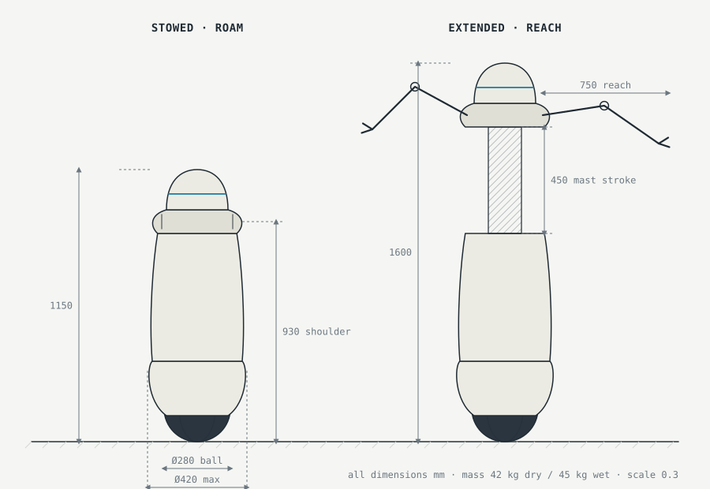
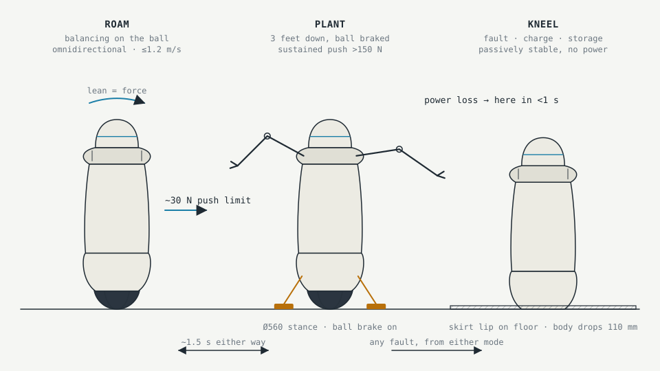
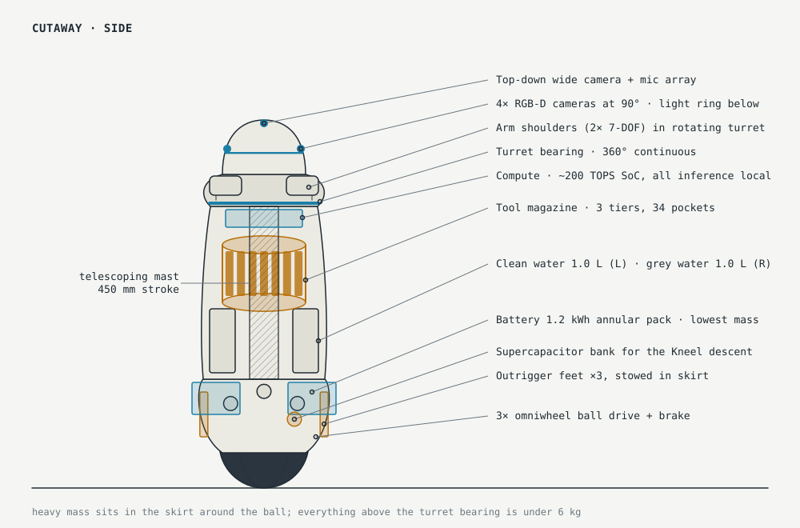
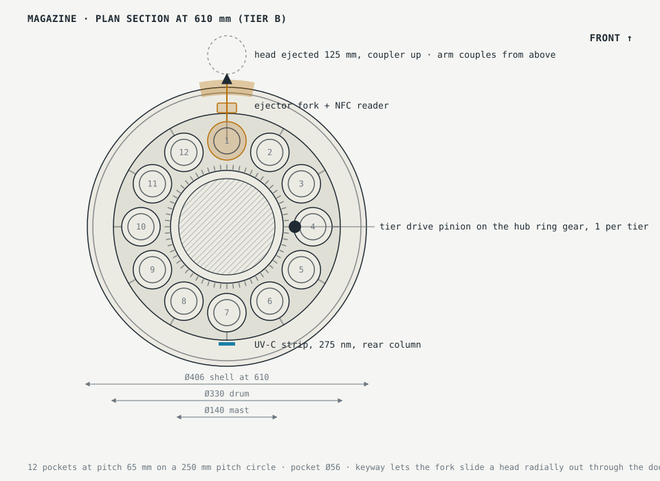
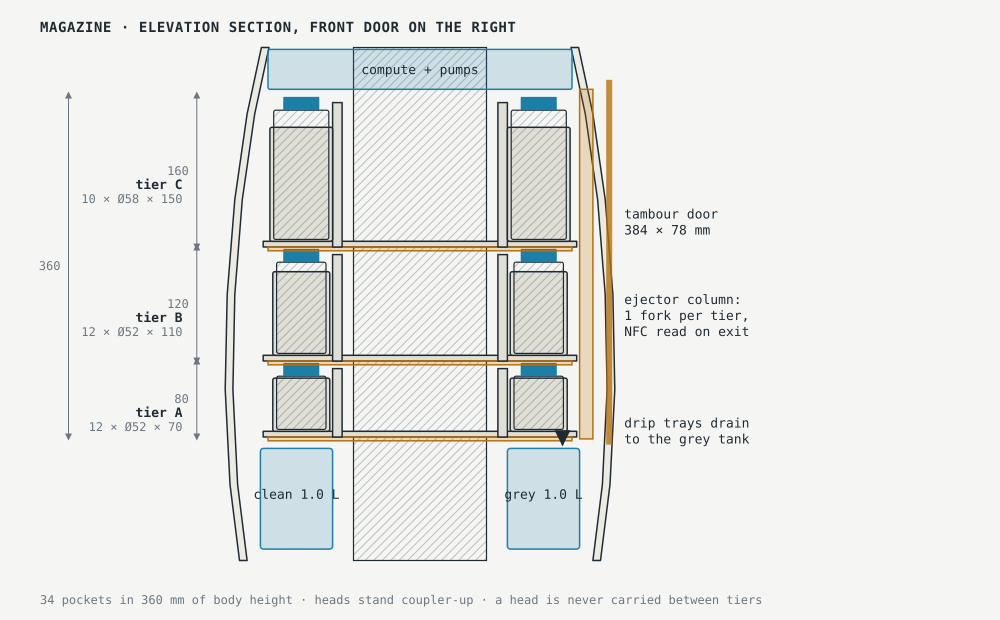
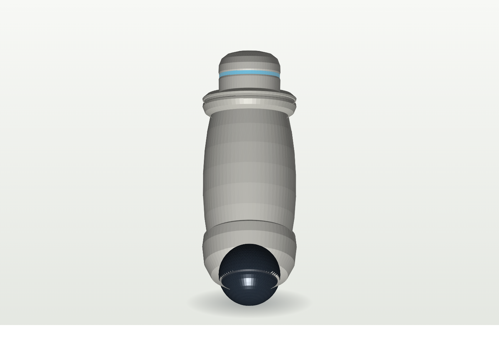
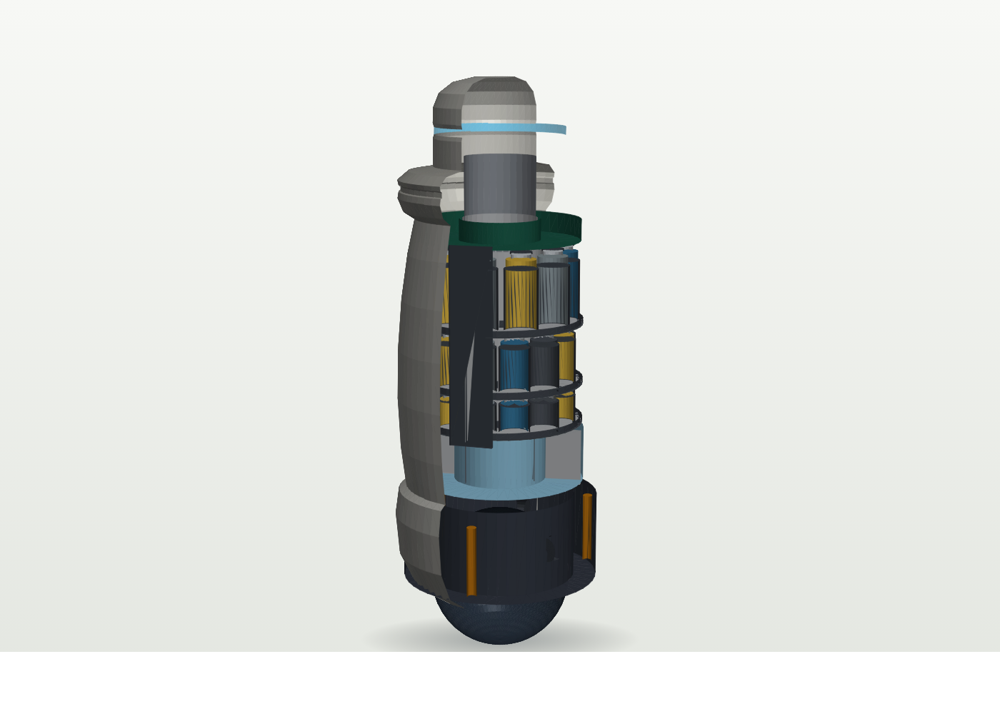
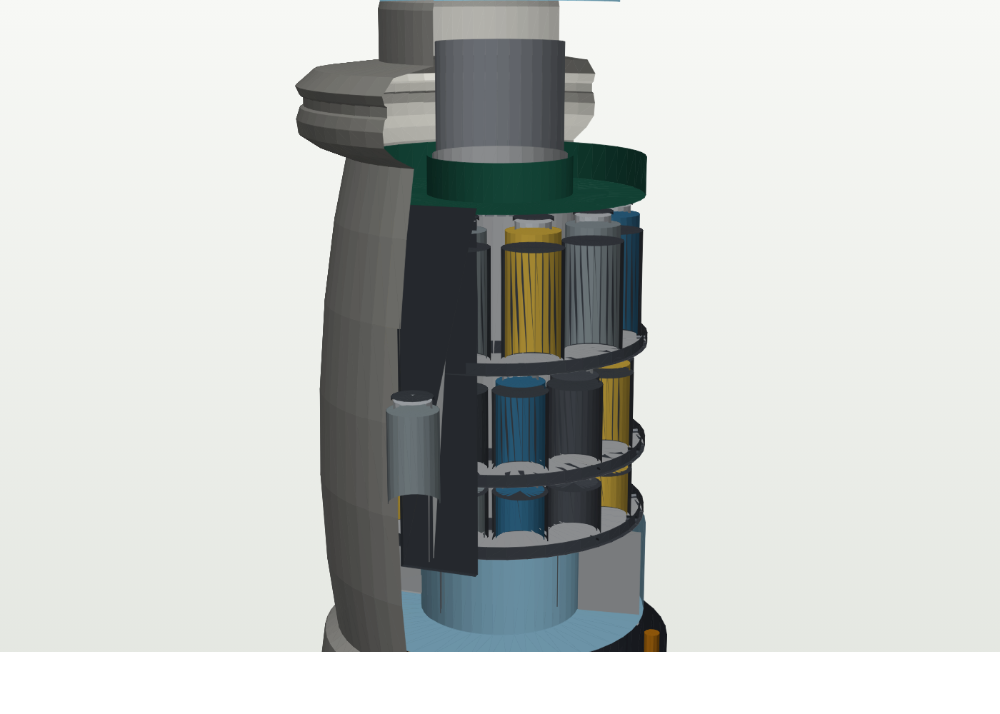
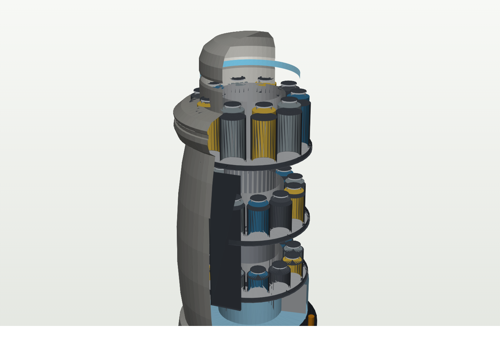
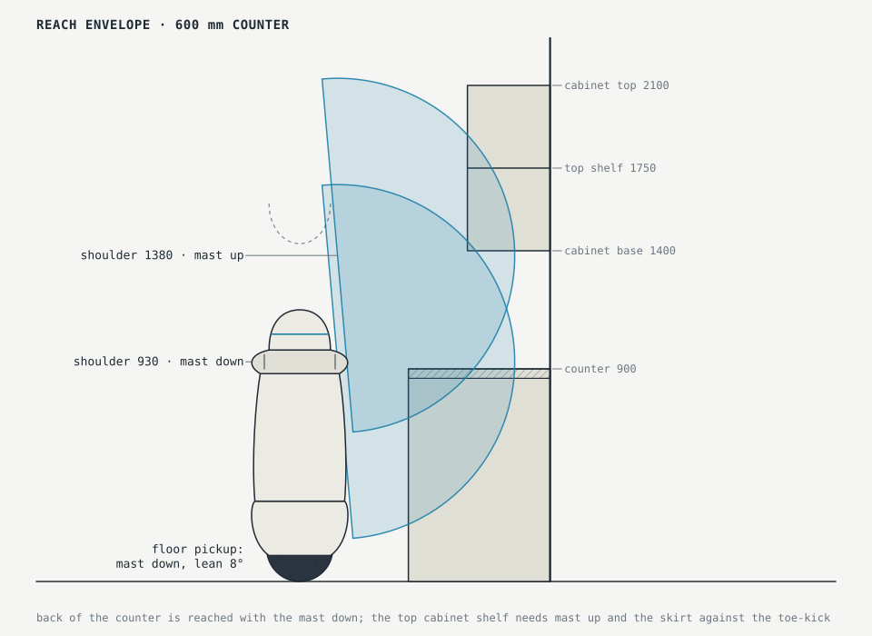

# Project GYRO — Single-ball home service robot

| Field | Value |
|---|---|
| Document | Concept design specification |
| Revision | 0.4 (pre-feasibility) |
| Date | 2026-09-05 |
| Status | Draft for design review |
| Visuals | `visuals/fig1.svg` … `fig8.svg` and `render-*.png` (generated from one dimensioned model) |

## 0. Summary

GYRO is a self-balancing household robot that rides a single 280 mm drive ball, carries its tools inside a sealed egg-shaped body, and deploys two general-purpose arms, two helper arms and a wiping wand from a rotating turret. It is deliberately not humanoid: it has no face, no legs, and no gait. It is an appliance with reach.

Revision 0.2 replaced the single 8-slot tool carousel with a three-tier, 34-pocket magazine (§5.3) and added rendered views of the model (§5.4). Revision 0.3 removed the onboard vacuum unit and its snorkel arm: the robot uses the household vacuum instead (§5.5). Revision 0.4 makes throughput a primary requirement: speed-and-separation monitoring replaces the fixed hand-speed cap, two helper arms join the two primary arms, and §5.6 sets a speed target per task. Outdoor tasks are an open platform decision (§11, item 7).

The original brief had four claims. Two survive intact, two need to be reframed before anyone spends money on them:

| Claim in the brief | Verdict | What the spec does about it |
|---|---|---|
| People will accept a non-humanoid robot more readily | **Holds.** The strongest part of the idea. | Design principle 1. No face, no eye contact, appliance semantics throughout. |
| One wheel, blob body | **Holds for locomotion, fails for work.** A balancing robot can only push as hard as it can lean, roughly 30 N. Scrubbing a pan needs more. | Two postures: Roam (balancing) and Plant (three feet down, ball braked, >100 N). See §3 and Figure 2. |
| Tools pop out of the body | **Holds, with a change of shape.** Eight dedicated pop-out arms do not fit in a 420 mm body. | Two general arms plus a three-tier internal magazine of 34 heads with a 4 s change cycle. See §5 and Figures 4, 7 and 8. |
| 4× a human's work in the same time and less space | **Holds for the hands-on part, not for the machines.** Four effectors, faster-than-human tips in an empty room and wider tool heads give 2–4× on manipulation-bound steps. Appliance cycles are unchanged, so "done" still waits on the dishwasher. | Throughput is a primary requirement (§5.6). Robot-hours are the scarce resource when the task list is long, so every task carries a speed target. See §9 and Figure 6. |

The single biggest unsolved problem is stairs. A wheeled or ball-riding robot cannot climb them, and this spec does not pretend otherwise (§11).

## 1. Design principles

1. **Appliance, not person.** No face, no head-tracking gaze, no anthropomorphic gestures. The robot signals intent with a light ring and short sounds, the way a dishwasher does. This is what makes it tolerable in a bedroom doorway at 6 am.
2. **Everything lives inside the shell.** No tools hang off the body when it roams. The stowed silhouette is one smooth solid so it can pass a 600 mm doorway with a child on either side without snagging.
3. **Small footprint over long reach.** A 420 mm body fits between a fridge and a counter edge, in a laundry closet, and behind a door. Reach comes from a 450 mm telescoping mast, not from a tall standing body.
4. **Safe to fail.** Any fault, including total power loss, ends with the robot resting on its skirt within one second. A balancing robot that can fall over is not a home product.
5. **Fast when alone, careful when close.** Robot-hours are the scarce resource, so the robot is built to beat a person on every hands-on task: four effectors working at once, tool tips at 2.5 m/s when no one is in the room, and heads wider than a hand. Speed is gated by distance to people (speed and separation monitoring), not capped by design. A person entering the room slows the robot; it never slows the schedule when nobody is there.
6. **Don't carry what the house already owns.** There is no vacuum unit on board. Whole-floor coverage is the robot vacuum's job; spot and edge vacuuming is done with the household stick vacuum, which GYRO picks up and operates like any other tool. The same rule applies to the sink, the dishwasher and the washing machine: GYRO carries the hands, the house supplies the machines.

## 2. General arrangement

| Parameter | Value | Note |
|---|---|---|
| Height, stowed | 1150 mm | Below a standard 1400 mm upper-cabinet base; head does not hit open cabinet doors |
| Height, mast up | 1600 mm | Shoulder ring rises from 930 mm to 1380 mm |
| Body diameter, max | 420 mm | At the skirt, 300 mm above floor |
| Body diameter, waist | 380 mm | |
| Drive ball | Ø280 mm, polyurethane over aluminium | Same class as CMU Ballbot / ETH Rezero |
| Floor footprint (Roam) | Ø280 contact patch | Effectively a point contact plus a 420 mm shadow |
| Floor footprint (Plant) | Ø500 mm stance | Three feet at 250 mm radius |
| Mass, dry | 45 kg | Budget in §10 |
| Mass, wet | 48 kg | 2 L water + 0.5 L detergent, 28 heads and 3 pad cassettes |
| Arm reach | 750 mm from shoulder | Two primary arms, §5 |
| Max lift height | ~2100 mm | Mast up, arm vertical; front of a 1750 mm shelf only, see §6 |
| Doorway clearance | 600 mm door with 90 mm each side | |

The proportions are set by two constraints pulling in opposite directions. The mass must sit as low as possible for balance, so the battery, water and ball drive fill the skirt. The arms must reach counters and cabinets, so the shoulders sit at 930 mm and lift a further 450 mm. The mast is what lets both be true without a tall, top-heavy body.

## 3. Locomotion: ball drive and postures

### 3.1 Roam

| Parameter | Value |
|---|---|
| Drive | 3 omniwheels at 120° on the ball, 3 × 250 W BLDC, 12:1 planetary |
| Speed | 1.2 m/s max, 0.6 m/s default indoors, 0.25 m/s within 1 m of a person |
| Acceleration | 1.5 m/s² |
| Threshold / obstacle | 20 mm step, 12 mm gap, 3° lean on carpet edges |
| Turning | Omnidirectional, zero radius; turret rotates independently |
| Balance loop | 1 kHz IMU + wheel odometry, LQR with model-predictive lean limiting |
| Sustained lateral force at 900 mm | ~30 N (lean-limited, m·g·d/h with d ≈ 0.06 m) |

> **Review note.** The single wheel is right for moving and wrong for working. A balancing robot exerts force by leaning; the moment it can generate is bounded by its mass times the horizontal offset it can safely hold, divided by the height it pushes at. For a 45 kg body pushing at counter height that is about 30 N, sustained. Scrubbing a baked-on pan is 20–50 N. Opening a stiff fridge door is 30–70 N. Lifting a full laundry basket from a front-loader shifts the centre of mass by more than the ball can chase on a wet floor. So the ball alone does not do the jobs in the brief. The fix is not to give up the ball, it is to give the robot a way to stand still.

### 3.2 Plant

Three outrigger feet stow in the skirt and deploy to a 500 mm stance in about 1.5 s. A friction brake locks the ball. In Plant the robot is a tripod with a low centre of mass and can sustain >100 N at counter height, limited by the feet's rubber pads rather than by balance. The controller enters Plant automatically before any task tagged high-force: scrubbing, prying, pulling a drawer, hauling laundry, holding a pot under a tap.

Plant also cuts idle power: the balance loop drops from 60 W to under 5 W, which matters for tasks like folding that take twenty minutes at one spot.

### 3.3 Kneel

The body drops 110 mm around the ball so the skirt lip carries the load on a rubber ring. The robot is passively stable with no power. Every fault path, including battery cut-off, brown-out, IMU disagreement and a tip-over prediction, ends here. Kneel is also the charging and storage posture. The transition from Roam is a controlled descent: the drive damps the fall so the lip lands at under 0.3 m/s.

A supercapacitor bank (100 F, 48 V) is sized to complete one Roam→Kneel descent after main power loss. This is the one non-negotiable safety component in the design.

### 3.4 Stairs

Not supported. See §11.

## 4. Body and internal layout

The body is three zones stacked on a telescoping mast:

| Zone | Height above floor | Contents |
|---|---|---|
| Skirt | 110–340 mm | Ball drive, brake, 1.2 kWh annular battery, 3 outrigger feet, supercapacitor bank, charge contacts on the lip |
| Mid-body | 340–880 mm | Clean water 1.0 L and grey water 1.0 L with pumps (350–460), three-tier tool magazine with 34 pockets (470–830), compute deck (836–878) |
| Turret + head | 880–1150 mm (+450 with mast) | 360° turret bearing, two primary arm shoulders, wand shoulder, sensor crown, speaker, light ring |

Shell: two-part rotomoulded polypropylene with a soft TPE band around the skirt and turret. Matte, single colour, no seams on the front. The head dome is a translucent polycarbonate ring so the light ring reads from any side.

Sealing: mid-body is IPX4. The magazine door and its drip trays drain into the grey tank. The robot can be hosed down at the skirt lip.

## 5. Manipulation

The brief pictures a body that pops out a different arm for each job. Eight single-purpose arms do not fit in 0.1 m³ and would each need their own actuators, sensors and safety cases. The spec keeps the feeling of the idea and changes the mechanism: general arms, specialised heads, stored densely in a magazine that the shell hides completely.

### 5.1 Primary arms (×2)

| Parameter | Value |
|---|---|
| Degrees of freedom | 7 (3 shoulder, 1 elbow, 3 wrist) |
| Reach | 750 mm shoulder to wrist coupler |
| Payload | 3 kg at full reach, 6 kg within 300 mm of the body |
| Tip speed | 2.5 m/s and 5 m/s² with no person within 1.5 m; 0.5 m/s within 1.5 m; 0.25 m/s within 0.5 m (speed and separation monitoring per ISO/TS 15066); stop in <100 ms |
| Joint speed | 360°/s max at the shoulder, 540°/s at the wrist |
| Actuation | Quasi-direct-drive, 6:1 planetary, back-drivable, joint torque sensing; liquid-cooled shoulder motors for sustained high-speed cycles |
| Hand | 3-finger underactuated, 12 tactile taxels per finger, 40 N grip, silicone pads |
| Wrist coupler | 3-lug bayonet, 4 pogo pins (power + data), 20 N·m rated |
| Wrist camera | Global-shutter RGB, 110° FOV, in the palm |
| Mass, each | 4.5 kg |

The arms stow flush inside the turret with the hands in recessed bays. Both shoulders sit on the turret so the robot can work on any side without moving the base, which matters in a galley kitchen and at a laundry machine.

### 5.2 Helper arms (×2) and wand

**Helper arms.** Two 4-DOF arms on the turret at 90° to the primaries, 600 mm reach, 3 kg payload, same wrist coupler and the same speed gating. They are the third and fourth hands a person does not have: they carry the tray, hold the dishwasher rack out, hold the pot the primary is scrubbing, hold a bag open, pass items into the primaries' workspace so the primaries never travel. They cost a third of a primary arm and weigh less than half, and in the dish timeline (§9) they are worth more than a third primary arm would be, because the shared resources at a sink reward holding, not grasping.

**Wand.** A 3-DOF arm with a 500 mm telescoping shaft from the turret. Head carries a 400 mm squeegee, spray nozzle, microfibre pad and a 275 nm UV-C strip. Wipes counters and tables while the arms are busy. The 400 mm blade is deliberate: it is nearly three times the width of a hand with a cloth, which is where most of its speed comes from.

Revision 0.2 also had a snorkel: a low arm carrying a hose from an onboard wet/dry vacuum. It is gone, together with the vacuum unit and its 1.5 L bin, because the house already owns a better vacuum than a 48 kg robot can carry. Wet spills are now handled by the wand's squeegee and absorbent pads from the magazine into the grey tank, and dry debris by the household vacuum (§5.5).

### 5.3 Tool magazine

The first draft had one 8-slot drum with radial heads. Two things killed it. The mast is Ø140 in the centre of the body, so the annulus around it is only 83 mm wide and no radial head longer than about 70 mm fits. And a single ring wastes 360 mm of body height that could hold three. The magazine is now a three-tier revolver: heads stand vertically in pockets, coupler up, around the mast.

| Tier | Height (mm above floor) | Pockets | Pocket size | Holds |
|---|---|---|---|---|
| A | 470–550 | 12 | Ø52 × 70 | Pads, mitts, pad cassettes |
| B | 550–670 | 12 | Ø52 × 110 | Brushes, suction cups, clips, nozzles |
| C | 670–830 | 10 | Ø58 × 150 | Long tools: squeegee, tongs, scraper, hooks |
| **Total** | 360 mm | **34** | | |

**Change cycle.** The arm requests a head. The tier's ring gear indexes the pocket to the front (each tier has its own pinion drive, so three heads can be staged at once). The tambour door opens. The ejector fork engages the groove under the coupler collar and slides the head 125 mm radially out along its keyway until it stands clear of the shell, coupler up. The arm descends onto it, the bayonet locks, and the fork releases. Return is the same in reverse; the fork centres the head on the pocket sleeve so the arm does not need to be precise. About 4 s end to end, unchanged from the single-drum version, because the index and eject steps overlap.

**Why vertical heads.** A vertical head drips into the tray, not onto the head below it. The arm couples from above with the wrist vertical, which is the hand's strongest orientation and the easiest to see with the palm camera. And pockets can be open-sided toward the rim, so the only moving parts per tier are one ring gear and one fork.

**Pad cassettes.** Three of the tier-A pockets are cassettes of ten fresh scrub or microfibre pads each. A used pad is dropped into a fourth pocket that is a bin. This is where the density pays off: the robot goes a week between consumable refills, and the dock refills cassettes rather than the robot carrying more water.

| Slot | Head | Tier | Used for |
|---|---|---|---|
| A1–A3 | Pad cassettes, 10 fresh pads each (scrub, microfibre, polish) | A | Pots, counters, screens |
| A4 | Used-pad bin | A | |
| A5–A6 | Microfibre mitts | A | Dusting, polishing |
| A7 | Melamine block holder | A | Scuffs, hob |
| A8 | Sponge holder | A | Sink, dishes |
| A9–A12 | Spare / user | A | |
| B1–B2 | Stiff brush, soft brush | B | Grout, oven rack, shoes |
| B3 | Bottle brush | B | Glasses, bottles |
| B4 | Suction cup Ø60 | B | Plates, glass doors |
| B5 | Twin suction cup Ø30 | B | Small flat items |
| B6–B7 | Garment clip pairs | B | Folding, hanging, pulling from the drum |
| B8 | Silicone spatula | B | Food prep, scraping |
| B9 | Spray nozzle, fan tip | B | Counters, mirrors |
| B10 | Stick-vacuum handle adapter (§5.5) | B | Holds and triggers the household vacuum |
| B11–B12 | Spare / user | B | |
| C1 | Squeegee, 200 mm blade | C | Glass, shower, counters |
| C2 | Silicone tongs | C | Hot items, cutlery basket |
| C3 | Scraper | C | Hob, stuck-on food |
| C4 | Reach hook | C | Behind furniture, high pulls |
| C5 | Dust wand | C | Blinds, lampshades |
| C6 | Tray gripper | C | Baking trays, drawers |
| C7–C10 | Spare / third-party | C | Open coupler spec |

Every head has an NFC tag in the base, read by the fork on the way out, so a user can put heads back in any pocket. A 275 nm UV-C strip on the rear column irradiates each tier as it indexes past. Heads are dishwasher-safe.

> **Review note.** The magazine now takes 45% of the mid-body volume and 5 kg, up from 22% and 3 kg. That is the price of "everything inside", and it is still right, but it pushed the compute up to a thin deck under the turret. There is no fourth tier: above 830 mm the body narrows for the turret bearing, and below 470 mm the water has to sit low for balance. If 34 pockets turn out to be too few, the answer is smarter heads (a brush that is also a scraper), not a taller body.

### 5.4 Views

The renders are generated from the same dimensioned model as the drawings. In the web version of this document the model is live: drag to orbit, scroll to zoom, and switch between the four views.

### 5.5 Using the household vacuum

Most homes already have a cordless stick vacuum. It weighs 1.5–3.5 kg, has a trigger or a latch switch on the handle, and lives on a wall dock. GYRO treats it as one more tool head that happens to live outside the shell.

| Requirement | Value |
|---|---|
| Vacuum mass held at the handle | up to 3.5 kg, within 300 mm of the body (6 kg payload zone) |
| Handle adapter | Magazine head B10: a cradle that clamps the handle to the wrist coupler and carries a small actuator over the trigger, so the hand is free and the trigger is under software control |
| Fit | Adjustable jaws, 28–45 mm handle diameter; per-model presets stored on the NFC tag |
| Posture | Plant for floor work; Roam only with the vacuum stowed vertical against the body |
| Reach on the floor | 750 mm arm plus the vacuum's own 600–700 mm tube covers a 1.2 m radius from a Plant position |
| Dock | The robot returns the vacuum to its own wall dock; it does not charge it |

What this buys: no bin to empty, no filter to clean, no second motor on board, and the vacuum gets replaced on the household's schedule rather than the robot's. What it costs: about 90 s per use for the pick-up and return trips, and it does nothing in a home without a stick vacuum. Whole-floor coverage is still the robot vacuum's job; GYRO cooperates with it through the same Matter integration it uses for the dishwasher and washer.

### 5.6 Throughput: how it beats a person, task by task

The argument for speed is utilisation. A robot that does twice as many tasks per hour clears a household's list in half the robot-hours, and in a shared or leased fleet that is directly revenue. So every task carries a speed target against a competent adult, and the mechanism that gets there is named, because "faster hands" alone does not.

| Task | Human | Target | Mechanism | What it needs |
|---|---|---|---|---|
| Evening dishes to dishwasher start | 26 min | 6.5 min (4×) | 4 effectors, no pre-rinse, tray carry, 3-plate gripper head | Helper arms, magazine head C7 (multi-plate clip) |
| Wipe counters and table | 8 min | 3 min (2.7×) | 400 mm squeegee on the wand, sprayed ahead by the arm | Wand as specified |
| Vacuum and dust a room | 25 min | 10 min (2.5×) | Stick vacuum at a steady 0.5 m/s with no pauses; dust wand on the other arm at the same time | Handle adapter B10, dust wand C5 |
| Laundry: transfer, hang, fold 20 items | 18 min | 12 min (1.5×) | Two folding arms plus two holders; fold on a heated board | Cloth manipulation policies; this is the schedule risk, not the hardware |
| Bathroom surfaces | 12 min | 6 min (2×) | Wand plus arm, Plant once per fixture | As specified |
| Tidy 30 objects to home | 10 min | 6 min (1.7×) | Tray carry, both arms sorting on the move | Recognition speed, not motion |
| Shovel a 20 m² driveway | 20 min | 4 min (5×) | A 600 mm plow blade, not a shovel: a vehicle task | Outdoor base (§11 item 7) |
| Power-wash siding, 60 m² | 60 min | 45 min (1.3×) | Bounded by the washer's flow; the robot only removes rest breaks and ladder moves | Outdoor base; tether to the pressure washer |
| Clean single-storey gutters, 40 m | 60 min | 20 min (3×) | Gutter head on a 4 m mast traversing continuously instead of ladder hops | Outdoor base with mast |
| Hang single-storey roofline lights, 30 m | 45 min | 20 min (2.2×) | Clip head on the mast, string fed from a reel | Outdoor base with mast |
| Two-storey gutters and lights | 90 min | not reachable | A 6 m mast on a door-sized base tips over; ladders are the one tool robots cannot use | Out of scope for any ground robot in this spec |

Two mechanisms do most of the work in that table. **Parallel effectors** turn a sequential job into a pipelined one, and **wider heads** cover more surface per stroke than a hand can. Raw tip speed matters least: a 2.5 m/s tip is only useful in an empty room, and most of the indoor tasks are bounded by a shared resource (tap, rack, drum) before they are bounded by hand speed. Where a task is really a vehicle task (snow, lawn), a blade or a deck beats hands by an order of magnitude and the spec says so rather than pretending arms will do it.

## 6. Workspace

| Target | Reachable? | Posture |
|---|---|---|
| Floor, 500 mm in front | Yes | Mast down, lean 8° or Plant |
| Counter, front to wall (600 mm) | Yes | Mast down |
| Sink basin bottom | Yes | Mast down, Plant |
| Lower cabinet, back of shelf | Yes | Mast down, kneel-adjacent lean |
| Upper cabinet, first shelf (1400 mm) | Yes | Mast up |
| Upper cabinet, top shelf (1750 mm) | Front 200 mm only | Mast up, skirt at toe-kick |
| Front-loader washer drum, back | Yes | Plant, arm to 700 mm |
| Top-loader washer, bottom of drum | Marginal | Mast up, arm vertical; drum depth >550 mm not reached |
| Dryer lint trap | Yes | Household vacuum with crevice tool |

The top shelf limit is a straightforward consequence of 750 mm arms. The alternatives are longer arms (mass and moment penalty at the top of a balancing robot, rejected), a 600 mm mast stroke (adds 3 kg and 90 mm of stowed height, worth testing in phase 2), or accepting that people store rarely used things up there.

## 7. Sensing, compute and privacy

| System | Specification |
|---|---|
| Depth vision | 4 × RGB-D at 90° on the head equator, 120° FOV each, 0.2–6 m |
| Top camera | Wide RGB looking down over the arms and body, for self-collision and grasp verification |
| Wrist cameras | 2, in-palm |
| Near-field | 8 ToF sensors in the skirt for feet, pets, cables |
| Tactile | Fingertip taxels, wrist 6-axis F/T, skirt bump ring |
| Audio | 6-mic array, on-device wake word, no always-on cloud audio |
| Floor | Wetness sensor and optical flow at the skirt |
| Compute | One SoC, ~200 TOPS INT8, 32 GB, all perception and policy inference on-device |
| Connectivity | Wi-Fi 6, Matter/Thread for appliances, BLE for the dock and tool tags |

Privacy is a product feature, not a legal note. There is no forward-facing "eye". Camera activity is shown on the light ring. Video never leaves the house by default; task learning uploads are opt-in, per task, and are sent as scene graphs and trajectories rather than raw frames. A physical shutter on the head covers all four depth cameras when the robot is parked.

## 8. Power, docking and consumables

| Parameter | Value |
|---|---|
| Battery | 1.2 kWh LFP, annular, 48 V, hot-swap not supported (mass sits too low to reach) |
| Runtime | 4–5 h active manipulation, 8 h mixed, 30 h Plant idle |
| Idle draw | 60 W Roam, <5 W Plant, 3 W Kneel |
| Charge | 0–80% in 70 min via skirt-lip contacts on the dock |
| Fail-safe | 100 F supercapacitor for the Kneel descent |
| Dock | Charges, drains grey water, refills clean water, holds 4 spare heads and 2 pad cassettes |
| Water | 1.0 L clean / 1.0 L grey; prefers the household tap when at a sink |

The robot does not carry hot water. It uses the sink for anything that needs it, which is what the Plant posture at a sink is for.

## 9. Task performance and the throughput claim

Per-grasp speed is taken at 1.2× a person's in an empty room at product maturity and 0.6× with a person nearby, because the speed gate is on. Current research systems are slower than both. The gains below come mostly from four effectors in parallel, wider heads and process changes, and the table marks which of those each row depends on.

| Task | Human | GYRO (mature) | Ratio on the manipulation step | What actually bounds "done" |
|---|---|---|---|---|
| Evening dishes, load + pots + counters | 26 min | 6.5 min | 4× | Dishwasher cycle ~2 h |
| Unload dishwasher, put away | 6 min | 3 min | 2× | Reach to top shelf |
| Laundry: transfer, hang, fold 20 items | 18 min | 12 min | 1.5× | Washer 50 min + dryer 60 min |
| Wipe kitchen after cooking | 8 min | 3 min | 2.7× | Wand blade width |
| Bathroom: sink, mirror, toilet exterior | 12 min | 6 min | 2× | Plant/relocate cycles |
| Tidy a room (30 objects to home) | 10 min | 6 min | 1.7× | Recognition, not motion |
| Vacuum and dust a room | 25 min | 10 min | 2.5× | Stick vacuum head width |
| Whole-floor vacuum, 60 m² | 20 min | not attempted | – | Delegated to the robot vacuum |

> **Review note.** Revision 0.1 said speed does not matter because the robot works while the family sleeps. That was wrong for the product being specified. It is true only when the robot has fewer tasks than hours, and a robot that also does the tidying, the bathrooms, the laundry and the outdoor list does not. Robot-hours are the scarce resource, tasks have windows that collide (dishes before bed, driveway before the commute), and in a leased fleet every saved minute is a minute sold to the next house. So throughput is now a primary requirement (§5.6). What has not changed: a dishwasher still takes two hours, and "done" for dishes and laundry is still the machine, not the hands. The honest claim is 2–4× on the hands-on part, and 12–18 hours a week of a person's attention returned.

The one place the "less space" half of the claim is straightforwardly true: GYRO in Plant occupies 0.2 m² of floor at a sink. A person working there occupies about 0.5 m² and needs another 0.6 m² to move. The robot can work in a galley kitchen while a person passes behind it.

## 10. Mass and cost budgets

| Subsystem | Mass | Volume BOM (10k/yr) |
|---|---|---|
| Ball, drive, brake, feet | 8.0 kg | $1,100 |
| Battery + BMS + supercap | 7.5 kg | $700 |
| Structure, mast, turret bearing | 6.0 kg | $900 |
| Primary arms ×2, hands | 9.0 kg | $4,200 |
| Helper arms ×2 | 4.0 kg | $1,200 |
| Utility arm (wand) | 1.5 kg | $350 |
| Magazine, 3 tiers, 34 pockets + 28 heads | 5.0 kg | $900 |
| Tanks, pumps | 1.2 kg | $180 |
| Sensors + compute | 2.0 kg | $1,300 |
| Shell, seals, light ring | 3.0 kg | $600 |
| Harness, misc | 1.0 kg | $300 |
| **Total** | **48 kg wet** | **≈ $11,730** |

At a 2.2× multiplier on BOM that is a $24–27k retail unit or a $350–450/month lease, which is the format most households will actually take. The arms are 46% of the cost and the lever for phase-3 reductions.

## 11. Risks and open questions

1. **Stairs.** A ball cannot climb them and a 45 kg robot cannot be carried. Options, in order of preference: sell one unit per floor (the base and body are cheap; the arms are not, and a dumb second body could share arms via the coupler spec), a home lift in new builds, or a stair-climbing dock module that is really a second robot. Single-floor is the phase-1 scope and this is the biggest reason a humanoid competitor could win multi-storey homes.
2. **Wet floors.** Omniwheel-on-ball drives slip on wet tile. Mitigations: wetness sensor forces Plant before any spill task, ball tread compound, and the wand squeegees its own path dry before the ball crosses it. This needs a test rig before anything else is built.
3. **Manipulation is the schedule risk, not the ball.** Ballbots have been stable since 2006. Folding a fitted sheet is not solved anywhere. Phase timing below assumes learned policies keep improving at the current rate; if they stall, the product ships as a dishes-and-wiping robot first.
4. **Acceptance is asserted, not measured.** The appliance-not-person principle is well supported by the uncanny-valley literature and by how people treat robot vacuums, but nobody has put a 1.15 m self-balancing egg in a family kitchen for a month. Run that study in phase 1 with a foam mock-up on a remote-controlled ballbot before locking the shell.
5. **Children and pets.** A balancing robot pushed by a child must not fall on them. Roam speed near people drops to 0.25 m/s; a shove beyond the lean limit triggers Kneel, not a recovery attempt. This must be tested to ISO 13482 with a dummy, not simulated.
6. **Noise.** Three omniwheels on a ball are audible. Target 45 dB(A) at 1 m in Roam, which is quieter than a fridge compressor, and this drives the ball tread and bearing choice.
7. **Outdoor scope is an open platform decision.** Gutters, power washing, roofline lights and snow are on the task list (§5.6). None of them can be done from a ball: a ball has no traction on snow, gravel, grass or a wet deck, cannot carry a 4 m mast, and cannot exert plow forces. There are three ways to resolve it. (A) Keep GYRO indoors and add a second, outdoor base: a tracked or four-wheel chassis, about 60 kg, 200 mm ground clearance, hydraulic outriggers, a 4 m telescoping mast with a 2-DOF head, and a tether port for the hose and pressure washer. The torso (turret, arms, magazine, compute, about 24 kg) transfers between bases at a dock in the garage in under two minutes, so there is one brain and one set of hands and two bodies. Estimated base cost $4–6k BOM. (B) One platform for everything, which means abandoning the ball for legs or tracks indoors and re-opening the humanoid question this concept was built to avoid. (C) Drop outdoor. Recommendation: A. Under any option, two-storey gutters and roofline lights stay out of scope: a 6 m mast on a door-sized base is a tip-over, and a ladder is the one tool no ground robot can use safely.

## 12. Development path

| Phase | Duration | Goal | Exit test |
|---|---|---|---|
| 1. Feasibility | 6 months | Ballbot base with Plant/Kneel; foam body; remote-controlled | 30-day in-home acceptance study; wet-floor rig; ISO 13482 push test |
| 2. Manipulation | 12 months | Two arms, carousel, wand; dishes end-to-end | 50 consecutive dish loads with <2% breakage in 3 kitchens |
| 3. Product | 12 months | Sealed shell, dock, laundry, safety certification | 1,000 h field trial, 20 homes, no unplanned Kneel from a push |
| 4. Cost-down | ongoing | Arm cost to $1,200 each; second-body sharing | Lease unit economics positive at $400/month |

## Appendix A. Specification summary

| | |
|---|---|
| Form | Self-balancing single-ball robot, egg body, no face |
| Height | 1150 mm stowed / 1600 mm mast up |
| Diameter | 420 mm max |
| Mass | 48 kg wet |
| Drive | Ø280 ball, 3 omniwheels, 1.2 m/s |
| Postures | Roam, Plant (3 feet), Kneel (fail-safe) |
| Arms | 2 × 7-DOF primary, 750 mm, 3 kg; 2 × 4-DOF helper, 600 mm; wiping wand with 400 mm blade |
| Tools | 3-tier internal magazine, 34 pockets, 4 s change, open coupler spec |
| Reach | Floor to 2100 mm; top-shelf front only |
| Sensing | 4 × RGB-D, 2 wrist cams, tactile, 6-mic array, floor wetness |
| Compute | ~200 TOPS on-device, no default cloud video |
| Power | 1.2 kWh, 4–5 h active, dock charge 70 min to 80% |
| Safety | ISO 13482 target, force-limited arms, supercap Kneel |
| Not supported | Stairs, hot water, onboard vacuum (uses the household vacuum) |
